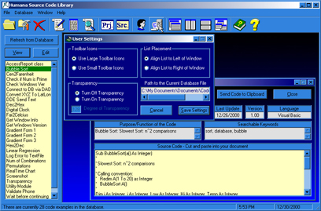



## A Source Code Library

### Description

This is a new version. New additions include 2 types of code, one project-based the other snippets and functions. More settings added, including large or small toolbar icons, dock list on left or right, activate and maintain transparency. Checks to see if the program has run before, and if not, it sets up the default Registry settings, and if so, it just runs the program. Now asks for database location based with the default bein App.Path\codelib.mdb. I am starting to get more reuseable code. Combining forms and functions based on the type of code and user action. I will eventually combine the ViewCode and Add/Edit code forms for both types. It will require a full rewrite of most of the functions and redesign of the forms. Also in the works is the program's compiled HTML help file. I have almost completed the commenting of the Sub/Function purposes. Please bear with me as the commenting of the code is not the highest priority, getting a working, useable application is the priority. I have included two (2) versions of the actual database: codelib.mdb-Access 2000, and codelib-97.mdb-Access 97. Please leave me comments and questions on the code itself. Votes are appreciated, but not needed. I would rather have the comments.
 
### More Info
 

             |
---                |---
**Submitted On**   |2000-12-30 18:09:34
**By**             |[VBScript](https://github.com/Planet-Source-Code/PSCIndex/blob/master/ByAuthor/vbscript.md)
**Level**          |Intermediate
**User Rating**    |4.9 (161 globes from 33 users)
**Compatibility**  |VB 6\.0
**Category**       |[Databases/ Data Access/ DAO/ ADO](https://github.com/Planet-Source-Code/PSCIndex/blob/master/ByCategory/databases-data-access-dao-ado__1-6.md)
**World**          |[Visual Basic](https://github.com/Planet-Source-Code/PSCIndex/blob/master/ByWorld/visual-basic.md)
**Archive File**   |[CODE\_UPLOAD1318712302000\.zip](https://github.com/Planet-Source-Code/vbscript-a-source-code-library__1-13872/archive/master.zip)

